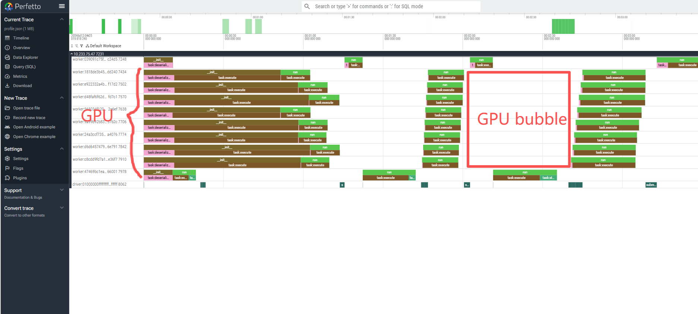
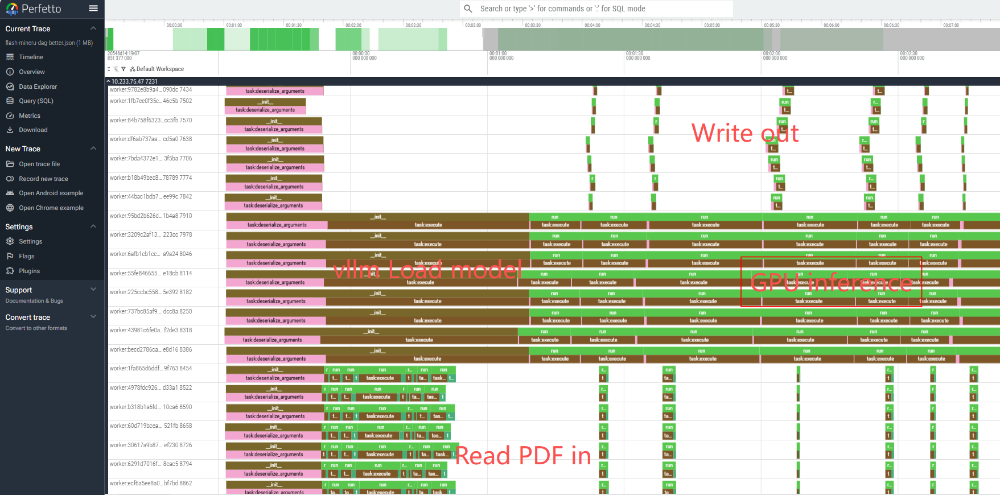

# Flash-MinerU ⚡️📄

<div align="center">


[](https://github.com/OpenDCAI/Flash-MinerU)
[](https://github.com/OpenDCAI/Flash-MinerU/issues)
[](https://github.com/OpenDCAI/Flash-MinerU/issues?q=is%3Aissue%20state%3Aclosed)
[](https://github.com/OpenDCAI/Flash-MinerU/pulls)
[](https://github.com/OpenDCAI/Flash-MinerU/pulls?q=is%3Apr+is%3Aclosed)
[](https://github.com/OpenDCAI/Flash-MinerU/graphs/contributors)
[](https://github.com/OpenDCAI/Flash-MinerU)


[](https://pypi.org/project/flash-mineru/)
[](https://pypi.org/project/flash-mineru/)
[](https://pypistats.org/packages/flash-mineru)
[](https://pepy.tech/projects/flash-mineru)
[](https://deepwiki.com/OpenDCAI/Flash-MinerU)

[简体中文](./README-zh.md) | English

</div>


> Accelerating the **VLM inference pipeline** of MinerU with **Ray**, turning PDF parsing into a **scalable data infrastructure component**

Flash-MinerU is a **lightweight, low-intrusion acceleration layer** for MinerU. Beyond speeding up VLM inference, it upgrades PDF parsing into a **high-throughput, distributed data pipeline**: a useful building block for modern AI systems.

PDFs are one of the most important **high-quality knowledge sources** for AI workflows, including papers, reports, and manuals. Converting them into **structured, model-ready data** such as Markdown and JSON is a foundational step for:

- 📊 **Data governance and curation**
- 🧪 **Synthetic data generation pipelines**
- 🧠 **LLM / MLLM training and evaluation**

Flash-MinerU focuses on making this stage **scalable, efficient, and production-ready**:

- **Minimal dependencies, lightweight installation**
  - One-line install via `pip install flash-mineru`
  - Works in constrained or domestic environments such as METAX
- **System-level acceleration, not reimplementation**
  - Fully reuses MinerU’s logic and data structures
  - Preserves output consistency
- **Designed for scale**
  - Multi-GPU / multi-process / multi-node ready
  - Built on **Ray** as a unified execution layer

---

## ✨ Features

- 🚀 **Ray-powered distributed execution**  
  Turns PDF parsing into a **scalable data pipeline**, from single-node multi-GPU setups to clusters

- 🧠 **High-throughput VLM inference**  
  Focuses on the bottleneck stage and currently defaults to **vLLM**

- 🔄 **Pipeline-parallel execution (core improvement)**  
  Uses an asynchronous pipeline with cross-stage overlap for sustained high utilization

- 🧩 **Low-intrusion, composable design**  
  Retains MinerU’s `middle_json` and downstream logic for easy integration

---

## 🎯 How pipeline parallelism helps

Flash-MinerU turns MinerU’s sequential pipeline into an **asynchronous pipelined system**:

- 🟢 **Much higher GPU utilization**  
  Keeps GPUs busy **more than 90% of the time**, while vanilla MinerU is often around **40-50%** because stages block each other

- 🔄 **Cross-stage overlap (key speedup)**  
  Different batches run in different stages at the same time, such as render / VLM / Markdown, instead of waiting for full completion

- ⚡ **Result: much higher throughput**  
  Less idle time plus more overlap leads to **significantly faster end-to-end processing**

<table width="100%">
<tr>
<td width="50%" valign="top" align="center">
<strong>Left — bubble schedule (before)</strong><br/>
<em>Batched sequential execution; GPU idle gaps.</em><br/><br/>

</td>
<td width="50%" valign="top" align="center">
<strong>Right — pipelined (Flash-MinerU)</strong><br/>
<em>Asynchronous pipeline; high utilization.</em><br/><br/>

</td>
</tr>
</table>

---

## 📦 Installation

### Basic installation (lightweight mode)

Suitable if you have **already installed the inference backend manually** (e.g., vLLM), or are using an image with a prebuilt environment:

```bash
pip install flash-mineru
```

### Install with vLLM backend enabled (optional)

If you want Flash-MinerU to install vLLM as the inference backend for you:

```bash
pip install flash-mineru[vllm]
```

---

## 🚀 Quickstart

### Minimal Python API example

```python
from flash_mineru import MineruEngine

# Path to PDFs
pdfs = [
    "resnet.pdf",
    "yolo.pdf",
    "text2sql.pdf",
]

engine = MineruEngine(
    model="<path_to_local>/MinerU2.5-2509-1.2B",
    # Model can be downloaded from https://huggingface.co/opendatalab/MinerU2.5-2509-1.2B
    batch_size=2,              # PDFs per logical batch; often choose a multiple of GPU count
    replicas=3,                # Parallel vLLM / model instances; often match GPU count
    num_gpus_per_replica=0.9,  # GPU memory fraction for vLLM KV cache per instance; 1.0 uses full VRAM headroom
    save_dir="outputs_mineru", # Output directory for parsed results
    inflight=4,                # Pipeline depth (v1.0.0 path); can raise on high-memory hosts with diminishing returns
)

# Legacy v0.0.4 sequential batching (deprecated): from flash_mineru import MineruEngineLegacy

results = engine.run(pdfs)
print(results)  # list[list[str]], dir name of the output files
```

### Output structure

* Each PDF’s parsing results will be generated under:

  ```
  <save_dir>/<pdf_name>/
  ```

* The Markdown file is located by default at:

  ```
  <save_dir>/<pdf_name>/vlm/<pdf_name>.md
  ```

---

## 📊 Benchmark

**Scripts:** [English](./docs/BENCHMARK.md) · [简体中文](./docs/BENCHMARK.zh.md)

### Results (368 PDFs, single-node ~8× A100 class)

| Method | Inference configuration | Total time |
|----|----|----|
| Flash-MinerU **v1.0.0** | `MineruEngine`, 8 replicas, `inflight=8`, pipeline parallelism | **~8.5 min** |
| MinerU (vanilla) | **Hand-spawned** pool of 8 `mineru` processes (**Benchmark-mineru.py** **parallel** mode, one GPU per process, `vlm-auto-engine`) | ~14 min |
| Flash-MinerU **v0.0.4** | `MineruEngineLegacy`, 8 replicas × 1 GPU, `batch_size=16`, batch-sequential | ~23 min |
| MinerU (vanilla) | vLLM, **single GPU** | ~65 min |

Commands: [docs/BENCHMARK.md](./docs/BENCHMARK.md).

### Summary

- **v1.0.0** is about **~1.7×** faster wall time than the **eight-process** baseline (~8.5 min vs ~14 min)
- **v0.0.4** (`MineruEngineLegacy`) is slower than that baseline (~23 min), which highlights what **pipeline parallelism** adds versus “many full stacks in parallel”
- **~65 min single-GPU** is the same-corpus reference baseline

<details>
<summary><strong>Experimental setup (expand)</strong></summary>

- **Dataset:** 23 paper PDFs (≈9–37 pages each) × 16 copies → **368** files; default folder `test/sample_pdfs`
- **Versions:** MinerU **v2.7.5**; Flash-MinerU **v0.0.4** = `MineruEngineLegacy` (sequential stages per batch); **v1.0.0** = `MineruEngine` (pipeline parallelism, default API)
- **Hardware:** single host, **8 × NVIDIA A100**

</details>

> Note: Throughput-focused. Output shape matches MinerU. Upstream does not ship a polished official multi-GPU “one click” path; the eight-process row is our **benchmark script** sharding **eight separate** `mineru` runs.

---

## 🗺️ Roadmap

* [x] Benchmark scripts & docs — [docs/BENCHMARK.md](./docs/BENCHMARK.md)
* [ ] Support for more inference backends (e.g., sglang)
* [ ] Service-oriented deployment (HTTP API / task queue)
* [ ] Sample datasets and more comprehensive documentation

---

## 🤝 Acknowledgements

* **MinerU**
  This project is built upon MinerU’s overall algorithm design and engineering practices, and parallelizes its VLM inference pipeline.
  The `mineru_core/` directory contains code logic copied from and adapted to the MinerU project.
  We extend our sincere respect and gratitude to the original authors and all contributors of MinerU.
  🔗 Official repository / homepage:
  [https://github.com/opendatalab/MinerU](https://github.com/opendatalab/MinerU)

* **Ray**
  Provides powerful abstractions for distributed and parallel computing, making multi-GPU and multi-process orchestration simpler and more reliable.
  🔗 Official website:
  [https://www.ray.io/](https://www.ray.io/)
  🔗 Official GitHub:
  [https://github.com/ray-project/ray](https://github.com/ray-project/ray)

* **vLLM**
  Provides a high-throughput, production-ready inference engine (currently the default backend).
  🔗 Official website:
  [https://vllm.ai/](https://vllm.ai/)
  🔗 Official GitHub:
  [https://github.com/vllm-project/vllm](https://github.com/vllm-project/vllm)

---

## 📜 License

**AGPL-3.0**

> Notes:
> The `mineru_core/` directory in this project contains derivative code based on **MinerU (AGPL-3.0)**.
> In accordance with the AGPL-3.0 license requirements, this repository as a whole is released under **AGPL-3.0** as a derivative work.
> For details, please refer to the root `LICENSE` file and `mineru_core/README.md`.

